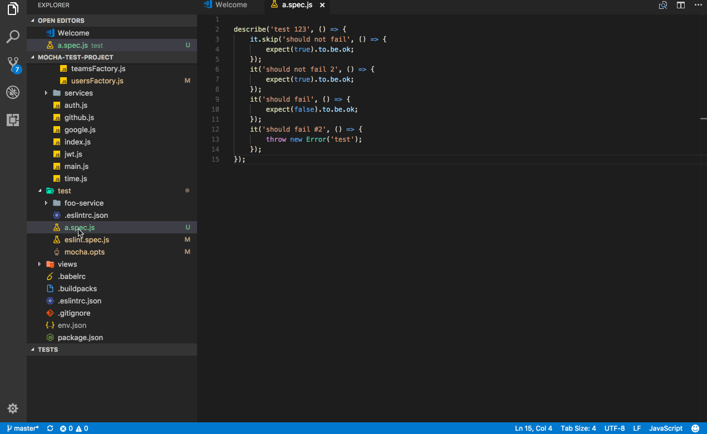

# mocha-test-runner

This is early alpha of Mocha Tests Runner extension that allow run mocha tests in more fluent was in vscode. 

## Settings

You can provide some aditional settings for your workspace

```
"mocha.path": {
    "type": "string",
    "default": "",
    "description": "Alternative path to mocha script"
}
```
```
"mocha.optsPath": {
    "type": "string",
    "default": "",
    "description": "Alternative path to mocha.opts file"
}
```

## Run all tests

```
Mocha: Run all tests
```

that command runs all tests in project

## Run all tests in file

```
Mocha: Run all tests in file
```

that command runs all tests in current active file

## Demo




